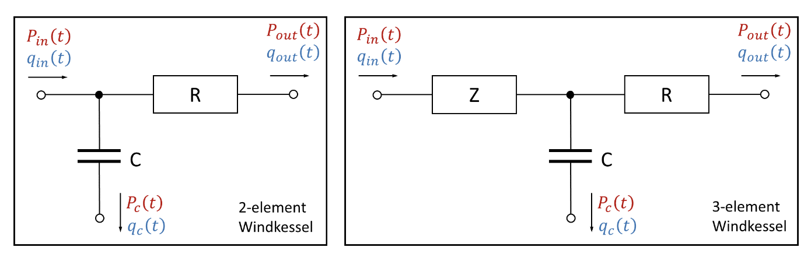

# WKPimpleFoam
 Integrate WK-2/3 model into OpenFoam slover pimpleFoam

## Follow these steps to set up WK Models:

1. Create a file named `constant/windkesselProperties`, in which the value of `outIndex` MUST equal to that of `index` in `0/p`.

2. The outlets' type in `0/p` is defined as `WKBC`.

3. Run `WKSimpleFoam` for flow simulation.

### WK2 and WK3 models are shown as following:

R, Z, and C in WK model can be set up in constant/windkesselProperties for each outlets. When Z = 0, WK3 is simplified to WK2 model.
