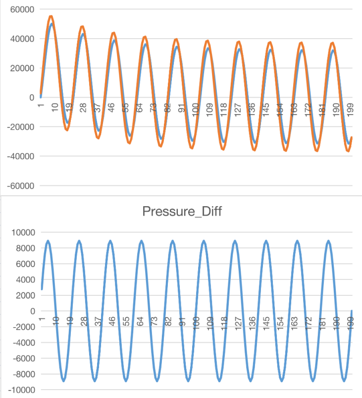

# 2D Poiseuille Flow Simulation

This is a sample case for the application of WKPimpleFoam

## Geometry and Mesh

The geometry is set with h $\times$ l equal to 1 $\times$ 30.

## Boundary Condition

A volume flowrate inlet BC is set-up according to

$$
Q_{mass,in}=Asin(2 \pi t)[kg/s]
$$

$A = 5 \* 10^{-4} [m^3 / s]$

## WK-3 Parameters

Set the model value as,
  
  $$
  R = 1.45 \cdot 10^8 [kg/m^4 s]
  C = 1.45 \cdot 10^{-8} [m^4 s^2 / kg]
  Z = 1.1 \cdot 10^7 [kg/m^4 s]
  $$
  
## Result

The inlet-outlet pressure variation and their difference are show as following,

